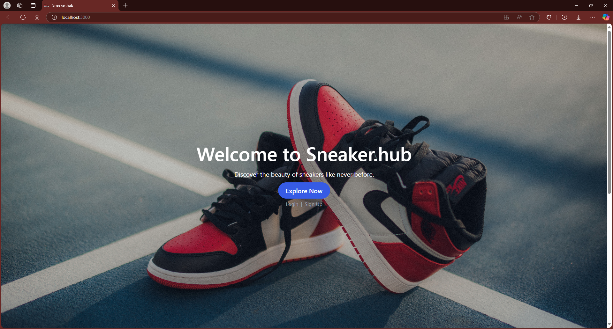
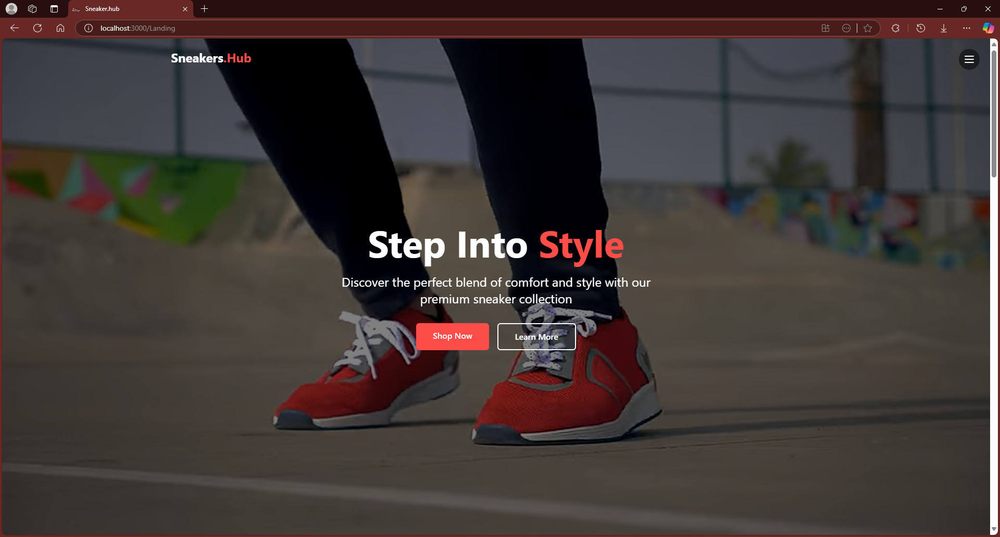
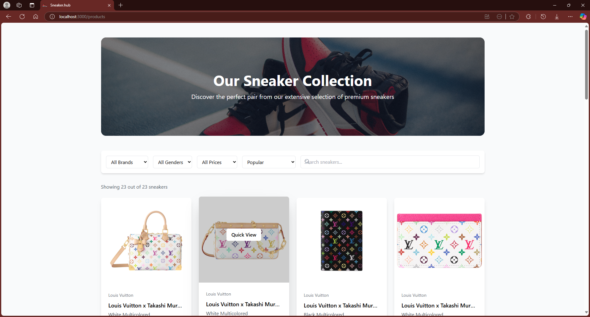

# Sneaker.Hub

Sneaker.Hub is a comprehensive platform for sneaker enthusiasts to explore, discover, and stay updated on the latest sneaker releases, prices, and trends. Our application leverages the Sneaks API to provide real-time data from major sneaker marketplaces.


## Features

- **Real-time Price Comparison**: Compare prices across multiple sneaker marketplaces including StockX, GOAT, Flight Club, and Stadium Goods
- **Extensive Sneaker Database**: Access information on thousands of sneakers
- **User Authentication**: Create an account to save favorite sneakers and receive price alerts
- **Responsive Design**: Seamless experience across desktop and mobile devices
- **Latest Releases**: Stay updated with the newest sneaker drops
- **Search & Filter**: Find specific sneakers by brand, model, price range, and more

## Tech Stack

### Frontend
- React.js
- CSS3
- HTML5
- JavaScript (ES6+)

### Backend
- Node.js
- Express.js
- MongoDB
- JWT Authentication
- Sneaks API

## Installation and Setup

### Prerequisites
- Node.js (version 16.x or higher)
- npm (version 8.x or higher)
- MongoDB (local or Atlas connection)

### Frontend Setup
```bash
# Clone the repository
git clone https://github.com/yourusername/sneakerhub.git

# Navigate to the frontend directory
cd sneakerhub/front

# Install dependencies
npm install

# Start the development server
npm start
```

### Backend Setup
```bash
# Navigate to the backend directory from the root
cd ../

# Install dependencies
npm install

# Create a .env file with the following variables
MONGO_URI=your_mongodb_connection_string
JWT_SECRET=your_jwt_secret_key
PORT=5000

# Start the server
npm run dev
```

## API Endpoints

### Authentication
- `POST /api/auth/register` - Register a new user
- `POST /api/auth/login` - Login a user
- `GET /api/auth/user` - Get current user (requires authentication)

### Sneakers
- `GET /api/sneakers` - Get all sneakers with pagination
- `GET /api/sneakers/:id` - Get a specific sneaker by ID
- `GET /api/sneakers/search/:query` - Search for sneakers
- `GET /api/sneakers/newest` - Get the latest releases
- `GET /api/sneakers/popular` - Get the most popular sneakers

### User
- `PUT /api/users/profile` - Update user profile (requires authentication)
- `POST /api/users/favorites/:id` - Add a sneaker to favorites (requires authentication)
- `DELETE /api/users/favorites/:id` - Remove a sneaker from favorites (requires authentication)
- `GET /api/users/favorites` - Get user's favorite sneakers (requires authentication)

## Project Structure

### Frontend
```
front/
├── node_modules/
├── public/
├── src/
│   ├── Assets/
│   │   └── Images/
|   |   └── Video/
│   ├── Pages/
│   │   ├── Explore.js - Browse and search sneakers
│   │   ├── Home.js - Dashboard for logged-in users
│   │   ├── Landing.js - Main landing page
│   │   ├── Login.js - User login
│   │   ├── Products.js - Individual sneaker details
│   │   └── Signup.js - User registration
│   ├── Styles/ - CSS styling for corresponding components
│   ├── App.js - Main application component
│   └── index.js - Application entry point
├── package.json - Frontend dependencies
```

### Backend
```
SneakerHub/
├── config/ - Database and JWT configuration
├── controllers/ - Route handlers for authentication, sneakers, and users
├── middleware/ - Authentication middleware
├── models/ - MongoDB schemas for customers and sneakers
├── routes/ - API route definitions
├── scrapers/ - Integration with sneaker marketplace data
└── server.js - Backend entry point
```

## Integration with Sneaks API

Sneaker.Hub leverages the Sneaks API to fetch real-time data from major sneaker marketplaces. The API is integrated through the backend scrapers:

- `flightclub-scraper.js` - Fetch data from Flight Club
- `goat-scraper.js` - Fetch data from GOAT
- `stadiumgoods-scraper.js` - Fetch data from Stadium Goods
- `stockx-scraper.js` - Fetch data from StockX

## Contributing

We welcome contributions to improve Sneaker.Hub! Please follow these steps:

1. Fork the repository
2. Create your feature branch (`git checkout -b feature/amazing-feature`)
3. Commit your changes (`git commit -m 'Add some amazing feature'`)
4. Push to the branch (`git push origin feature/amazing-feature`)
5. Open a Pull Request

## License

This project is licensed under the MIT License - see the LICENSE file for details.

## Acknowledgements

- [Sneaks API](https://github.com/druv5319/Sneaks-API) for providing the sneaker data
- All the sneaker marketplaces for their public data
- The open-source community for their invaluable resources

      